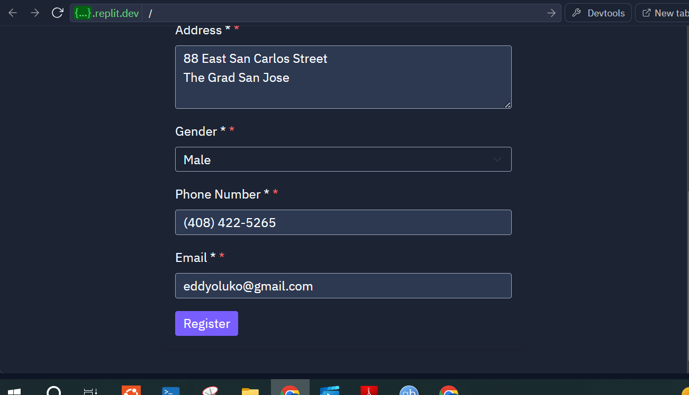
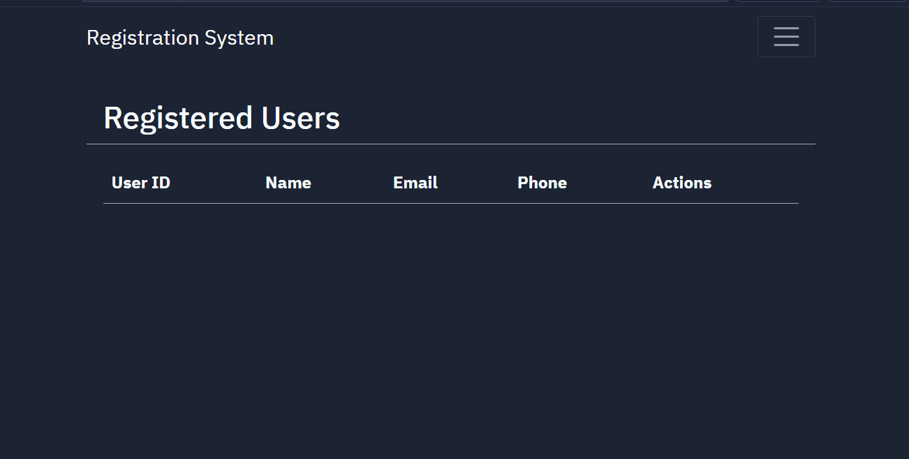

# User Registration and Management System

A comprehensive Flask-based user registration and management system with advanced administrative capabilities. The platform implements robust form validation, PostgreSQL data persistence, and features an admin dashboard for user statistics and management.

## Features

### User Management
- User registration with comprehensive form validation
- User profile editing
- User listing and management
- Admin dashboard with statistical analysis
- PDF report generation for user profiles

### Security
- Client and server-side validation
- CSRF protection
- Secure password hashing
- Role-based access control (Admin/User)

### UI/UX
- Bootstrap UI framework with dark theme support
- Responsive design
- Interactive form validation
- Real-time feedback
- Admin/User role indicators

## Technical Architecture

### Backend
- **Framework**: Flask
- **Database**: PostgreSQL
- **ORM**: SQLAlchemy
- **Form Handling**: Flask-WTF
- **Password Security**: Werkzeug Security
- **PDF Generation**: pdfkit

### Frontend
- **Framework**: Bootstrap 5
- **Theme**: Replit Dark Theme
- **Validation**: Custom JavaScript
- **Styling**: Custom CSS with Bootstrap variables

## Screenshots and UI Documentation

### Registration Form

- Clean, intuitive registration interface
- Real-time form validation
- Required field indicators
- Phone number formatting
- Comprehensive error messages

### User Management

- Tabulated user listing
- Action buttons for each user
- Responsive table design
- Easy access to user actions

### Admin Dashboard
The admin dashboard provides:
- Total user count
- Gender distribution statistics
- Latest registrations
- User management capabilities
- Admin status toggle
- User deletion functionality

## Installation and Setup

1. Clone the repository
2. Install dependencies:
```bash
pip install -r requirements.txt
```

3. Set up environment variables:
```
DATABASE_URL=postgresql://...
FLASK_SECRET_KEY=your_secret_key
```

4. Initialize the database:
```python
flask db upgrade
```

5. Run the application:
```bash
python main.py
```

## Security Considerations

1. **Password Security**
   - Passwords are hashed using Werkzeug's security functions
   - No plain-text password storage
   - Strong password requirements enforced

2. **Form Security**
   - CSRF protection on all forms
   - Input validation and sanitization
   - Secure form handling

3. **Access Control**
   - Role-based access control
   - Session management
   - Protected admin routes

## Code Structure

```
├── static/
│   ├── css/
│   │   └── style.css      # Custom styling
│   └── js/
│       └── validation.js  # Client-side validation
├── templates/
│   ├── admin/
│   │   └── dashboard.html # Admin dashboard
│   ├── base.html         # Base template
│   ├── login.html        # Login page
│   ├── register.html     # Registration page
│   └── users.html        # User listing
├── app.py               # Main application file
├── forms.py            # Form definitions
├── models.py           # Database models
└── main.py            # Entry point
```

## API Documentation

### User Management Routes

#### Registration
- **Route**: `/`
- **Method**: POST
- **Purpose**: Register new users
- **Fields**:
  - user_id (unique identifier)
  - password
  - first_name
  - last_name
  - address
  - gender
  - phone
  - email

#### User Listing
- **Route**: `/users`
- **Method**: GET
- **Purpose**: Display registered users
- **Access**: Authenticated users

#### Profile Editing
- **Route**: `/edit_profile/<user_id>`
- **Method**: GET, POST
- **Purpose**: Edit user profiles
- **Access**: User (own profile) or Admin

### Admin Routes

#### Dashboard
- **Route**: `/admin/dashboard`
- **Method**: GET
- **Purpose**: Admin dashboard access
- **Access**: Admin only

#### User Management
- **Route**: `/admin/toggle_admin/<user_id>`
- **Method**: POST
- **Purpose**: Toggle admin status
- **Access**: Admin only

#### User Deletion
- **Route**: `/admin/delete_user/<user_id>`
- **Method**: POST
- **Purpose**: Delete users
- **Access**: Admin only

## Development Guidelines

1. **Coding Standards**
   - Follow PEP 8 guidelines
   - Use meaningful variable names
   - Include docstrings and comments
   - Maintain consistent indentation

2. **Error Handling**
   - Implement proper exception handling
   - Log errors appropriately
   - Provide user-friendly error messages

3. **Database Operations**
   - Use SQLAlchemy ORM
   - Implement proper transaction handling
   - Handle database errors gracefully

4. **Testing**
   - Write unit tests for critical functionality
   - Test form validation
   - Test database operations
   - Test access control

## Maintenance and Updates

1. **Database Migrations**
   - Use Flask-Migrate for schema changes
   - Test migrations before deployment
   - Backup data before major changes

2. **Security Updates**
   - Regularly update dependencies
   - Monitor for security vulnerabilities
   - Implement security patches promptly

3. **Performance Optimization**
   - Monitor database performance
   - Optimize queries when needed
   - Implement caching if required
